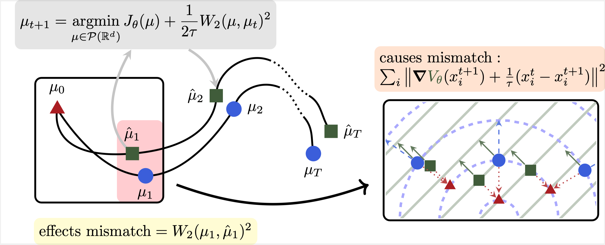

# Learning Diffusion at Lightspeed
<h3><a href="">Paper</a> | <a href="https://www.antonioterpin.com/projects/learning-diffusion-lightspeed">Project Page</a> </h3>

**Authors:** Antonio Terpin, Nicolas Lanzetti, Florian Dörfler

This repo contains a JAX implementation of the JKOnet* architecture presented in "Learning Diffusion at Lightspeed". 


## Abstract 🤓
<p align='center'> </p>

Diffusion regulates a phenomenal number of natural processes and the dynamics of many successful generative models. Existing models to learn the diffusion terms from observational data rely on complex bilevel optimization problems and properly model only the drift of the system.
We propose a new simple model, `JKOnet`, which bypasses altogether the complexity of existing architectures while presenting significantly enhanced representational capacity: `JKOnet` recovers the potential, interaction, and internal energy components of the underlying diffusion process. `JKOnet` minimizes a simple quadratic loss, runs at lightspeed, and drastically outperforms other baselines in practice. Additionally, `JKOnet` provides a closed-form optimal solution for linearly parametrized functionals. 
Our methodology is based on the interpretation of diffusion processes as energy-minimizing trajectories in the probability space via the so-called JKO scheme, which we study via its first-order optimality conditions, in light of few-weeks-old advancements in optimization in the probability space.


## Getting started 🛠️
The following works on macOS 13.2.1 and should work also on Ubuntu. Windows may require additional packages.
1. Install [miniconda](https://conda.io).
2. Create an environment:
```bash
conda create --name jkonet-star python=3.12
conda activate jkonet-star
```
1. Install requirements 
```bash
pip install -r requirements.txt
```

## Generating the data 🧩
```bash
python data_generator.py --potential $potential --interaction $interaction --internal wiener --beta $beta --interaction $interaction
```
### Example 1.
```bash
python data_generator.py --potential styblinski_tang
```

### Parameters
| Argument             | Description                                                                                   | Type   | Default |
|----------------------|-----------------------------------------------------------------------------------------------|--------|---------|
| `--load-from-file`   | Path to a file to load the trajectory from, instead of generating new data.                   | string | None    |
| `--potential`        | Name of the potential energy to use.                                                          | string | 'none'  |
| `--n-timesteps`      | Number of timesteps for the SDE simulation.                                                   | int    | 5       |
| `--dt`               | Time step size in the SDE simulation.                                                         | float  | 0.01    |
| `--internal`         | Name of the internal energy to use, e.g., 'wiener'.                                           | string | 'none'  |
| `--beta`             | Standard deviation of the Wiener process, required if `--internal` is 'wiener'.               | float  | 0.0     |
| `--interaction`      | Name of the interaction energy to use.                                                        | string | 'none'  |
| `--dimension`        | Dimensionality of the system.                                                                 | int    | 2       |
| `--n-particles`      | Number of particles in the system.                                                            | int    | 1000    |
| `--batch-size`       | Batch size for computing couplings.                                                           | int    | 1000    |
| `--n-gmm-components` | Number of components of the Gaussian Mixture Model. Set to 0 for no GMM.                      | int    | 10      |
| `--seed`             | Seed for the random number generator to ensure reproducibility.                               | int    | 0       |

### How do I use custom data?
The `load-from-file` parameter allows to load the snapshots, a `(T, N, dim)` array, from the file provided. In this case, the script computes the couplings and fits the densities, but it does not generate new data.

### Functions
Current options for `$potential` and `$interaction`:
- double_exp
- styblinski_tang
- rotational
- relu
- flat
- beale
- friedman
- moon
- ishigami
- three_hump_camel
- bohachevsky
- holder_table
- cross_in_tray
- oakley_ohagan
- sphere

### Generating all the data for the paper
```bash
for potential in double_exp styblinski_tang rotational relu flat beale friedman moon ishigami three_hump_camel bohachevsky holder_table cross_in_tray oakley_ohagan sphere
do
    for beta in 0.0 0.1 0.2 0.5 1.0
    do
        for interaction in double_exp styblinski_tang rotational relu flat beale friedman moon ishigami three_hump_camel bohachevsky holder_table cross_in_tray oakley_ohagan sphere
        do
        python data_generator.py --potential $potential --interaction $interaction --internal wiener --beta $beta
        done
    done

    for dim in 10 20 30 40 50
    do
        for nparticles in 1000 2500 5000 75000 10000
        do
            python data_generator.py --potential $potential --internal wiener --beta 0.0 --n-particles $nparticles --dimension $dim
        done
    done
done
```
Note that this script will take a while and quite some disk space, as it generates quite some dataset. We recommend trying out the single experiments of interest as described in Example 1.

## Training 🚀
The `data_generator.py` script creates a folder `$dataset` in `data/`. You can then train a model as follows:

```bash
python train.py --solver $solver --dataset $dataset
```
where `$solver` is one of:
- jkonet
- jkonet-vanilla
- jkonet-monge-gap
- jkonet-star
- jkonet-star-potential
- jkonet-star-potential-internal
- jkonet-star-linear
- jkonet-star-linear-potential
- jkonet-star-linear-potential-internal

### Example 1.
```bash
python train.py --solver jkonet-star-potential --dataset potential_styblinski_tang_internal_none_beta_0.0_interaction_none_dt_0.01_T_5_dim_2_N_1000_gmm_10_seed_0
```

### Training all models on all the data for the paper
```bash
for potential in double_exp styblinski_tang rotational relu flat beale friedman moon ishigami three_hump_camel bohachevsky holder_table cross_in_tray oakley_ohagan sphere
do
    for beta in 0.0 0.1 0.2 0.5 1.0
    do
        for interaction in double_exp styblinski_tang rotational relu flat beale friedman moon ishigami three_hump_camel bohachevsky holder_table cross_in_tray oakley_ohagan sphere
        do
            for model in jkonet jkonet-vanilla jkonet-monge-gap jkonet-star jkonet-star-potential jkonet-star-potential-internal jkonet-star-linear jkonet-star-linear-potential jkonet-star-linear-potential-internal
            do
                python train.py --solver $model --dataset potential_$potential\_internal_wiener_beta_$beta\_interaction_none_dt_0.01_T_5_dim_2_N_1000_gmm_10_seed_0
            done
        done
    done

    for dim in 10 20 30 40 50
    do
        for nparticles in 1000 2500 5000 75000 10000
        do
            python train.py --solver $model --dataset potential_$potential\_internal_wiener_beta_0.0_interaction_none_dt_0.01_T_5_dim_$dim\_N_$nparticles\_gmm_10_seed_0
        done
    done
done
```
Note that this script will take a while and quite some disk space, as it runs quite some experiments. In particular, the jkonet family will consume days of compute. We recommend trying out the single experiments of interest as described in Example 1. Consider combining this script with the data generation, and using the `--wandb` flag.


## Citation 🙏
```
@article{terpin2024learning,
  title={{Learning Diffusion at Lightspeed}},
  author={Terpin, Antonio and Lanzetti, Nicolas and D\"orfler, Florian},
  journal={}
  year={2024},
}
```

## Contact and Contributing
In case you have any questions or if you want to help improving the codebase, please reach out to [Antonio Terpin](mailto:aterpin@ethz.ch).