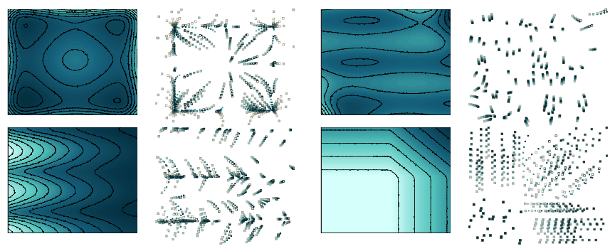

# Learning diffusion at lightspeed (NeurIPS 2024, oral presentation)
<h3><a href="https://arxiv.org/abs/2406.12616">Paper</a> | <a href="https://jkonet-star.readthedocs.io/en/latest/">Project page and documentation</a> </h3>

**Authors:** Antonio Terpin, Nicolas Lanzetti, Martin Gadea, Florian Dörfler

This repo contains a JAX implementation of the JKOnet* architecture presented in "Learning diffusion at lightspeed". Please check out the <a href="https://jkonet-star.readthedocs.io/en/latest/">project page and documentation</a> for all the information.


## Abstract 🤓
<p align='center'> </p>

Diffusion regulates numerous natural processes and drives the dynamics of many successful generative models. Current models for learning diffusion terms from observational data often require complex bilevel optimization problems and primarily focus on modeling the drift component of the system.

We propose a new simple model, JKOnet*, which bypasses the complexity of existing architectures while presenting significantly enhanced representational capabilities: JKOnet* recovers the potential, interaction, and internal energy components of the underlying diffusion process. JKOnet* minimizes a simple quadratic loss and outperforms other baselines in terms of sample efficiency, computational complexity, and accuracy. Additionally, JKOnet* provides a closed-form optimal solution for linearly parametrized functionals, and, when applied to predict the evolution of cellular processes from real-world data, it achieves state-of-the-art accuracy at a fraction of the computational cost of all existing methods.

## Installation guide
- [Docker](#docker)
- [MacOS](#macos)
- [Ubuntu](#ubuntu)
- [Windows](#windows)

**Note**: The installation instructions provided here are not GPU friendly. If you have a GPU, install the necessary packages for GPU support. Running the experiments on a GPU can yield significant speedups, especially for the JKOnet* full model (`jkonet-star`). We collected the training times on a RTX 4090.

To start, clone the repo:

```bash
git clone git@github.com:antonioterpin/jkonet-star.git
```

### Docker

Docker needs to be installed on your machine before proceeding. You can download Docker from the official site: https://www.docker.com/.

Once Docker is installed and running, follow these steps to build the Docker image. Execute the following command from the root directory of the repository:

```bash
docker build -t jkonet-star-app .
```

If you encounter any issues with the Docker build, ensure that Docker is running and that you have the necessary permissions to execute Docker commands. You can also try to pull the `python:3.12-slim` image before building the `jkonet-star-app` image:

```bash
docker pull python:3.12-slim
```

#### Running JKOnet* using Docker

After building the image, you can generate data and train models by executing the following commands:

```bash
# Generate population data
docker run -v "$(pwd)/:/app" jkonet-star-app python data_generator.py --potential wavy_plateau --dataset-name test-wavy-plateau

# Train the model on the generated dataset
docker run -v "$(pwd)/:/app" jkonet-star-app python train.py --solver jkonet-star-potential --dataset test-wavy-plateau
```

### MacOS

These steps have been tested on MacOS 13.2.1 and should also work on Ubuntu systems.

#### Steps:

1. **Install Miniconda**

   Download and install Miniconda from the official website: https://docs.conda.io/en/latest/miniconda.html.

2. **Create a Conda environment**

   Open a terminal and run the following commands to create and activate a new Conda environment:

```bash
   conda create --name jkonet-star python=3.12
   conda activate jkonet-star
```

3. **Install the required packages**

   Once the environment is activated, install the necessary dependencies:

```bash
   pip install -r requirements.txt
```
   To install `parallel` (used for running the benchmarks), you can use the following command on MacOS:

```bash
   brew install parallel
```

### Ubuntu

These steps have been tested on Ubuntu systems.

#### Steps:

1. **Install Miniconda**

   Download and install Miniconda from the official website: https://docs.conda.io/en/latest/miniconda.html.

2. **Create a Conda environment**

   Open a terminal and run the following commands to create and activate a new Conda environment:

```bash
   conda create --name jkonet-star python=3.12
   conda activate jkonet-star
```

3. **Install the required packages**

   Once the environment is activated, install the necessary dependencies:

```bash
   pip install -r requirements.txt
```
   To install `parallel` (used for running the benchmarks), you can use the following command on Ubuntu:

```bash
   sudo apt-get install parallel
```


### Windows

The following instructions are for Windows 11 users. Please note that Python 3.9 is required for compatibility.

#### Steps:

1. **Install Miniconda**

   Download and install Miniconda from the official website: https://docs.conda.io/en/latest/miniconda.html.

2. **Create a Conda environment**

   Run the following commands in your terminal to create and activate the environment with Python 3.9:

```bash
   conda create --name jkonet-star python=3.9
   conda activate jkonet-star
```

3. **Install the required packages**

   Once the environment is activated, install the necessary dependencies for Windows:

```bash
   pip install -r requirements-win.txt
```

---

## Example
To generate population data driven by a potential energy function (e.g., the wavy_plateau function), run the following command:

```bash
   # Generate population data
   python data_generator.py --potential wavy_plateau --dataset-name test-wavy-plateau
```

To train the JKOnet* modeling only the potential energy on the generated data, run the following command:

```bash
   # Train the model on the generated dataset
   python train.py --solver jkonet-star-potential --dataset test-wavy-plateau
```

The figure below displays the ground truth potential (left) and the recovered potential from JKOnet* (right).
<p align='center'> </p>

## Citation
If you use this code in your research, please cite our paper (NeurIPS 2024, Oral Presentation):
```bash
   @article{terpin2024learning,
      title={Learning diffusion at lightspeed},
      author={Terpin, Antonio and Lanzetti, Nicolas and Gadea, Mart{\'\i}n and D\"{o}rfler, Florian},
      journal={Advances in Neural Information Processing Systems},
      volume={37},
      pages={6797--6832},
      year={2024}
   }
```

## Compiling the documentation with Sphinx
To compile the documentation using Sphinx, navigate to the root directory of your project and run the following command to build the HTML documentation:
```bash
sphinx-build -b html ./docs ./docs/build/
```
This command tells Sphinx to generate HTML files from the source files located in the ./docs directory and place the generated files in the ./docs/build/ directory.

The compiled HTML pages will be located in the docs/build directory. You can open the index.html file in your web browser to view the documentation.