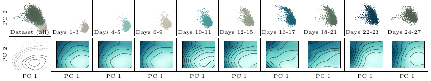

Learning single-cell diffusion dynamics 🧬
=============================================

Understanding the time evolution of cellular processes subject to external stimuli is a fundamental open question in biology. Motivated by the intuition that cells differentiate minimizing some energy functional, we deploy JKOnet\* to analyze the embryoid body single-cell RNA sequencing (scRNA-seq) data :cite:`RNA_dataset` describing the differentiation of human embryonic stem cells over a period of 27 days.

Generating the data 
-------------------

The dataset used is the one from Moon :cite:`RNA_dataset`. The dataset is publicly available as
``scRNAseq.zip`` at Mendeley Datasets at `this link <https://data.mendeley.com/datasets/v6n743h5ng/>`_.
This dataset tracks the differentiation of human embryonic stem cells over a 27-day period, with cell snapshots
collected at the following time intervals:

+------------------+------------------+------------------+------------------+------------------+------------------+
| Timesteps        | :math:`t_{0}`    | :math:`t_{1}`    | :math:`t_{2}`    | :math:`t_{3}`    | :math:`t_{4}`    |
+------------------+------------------+------------------+------------------+------------------+------------------+
| Days             | 0 - 3            | 6 - 9            | 12 - 15          | 18 - 21          | 24 - 27          |
+------------------+------------------+------------------+------------------+------------------+------------------+

We follow the data pre-processing in :cite:`tong2020trajectorynet` and :cite:`tong2023improving`; in particular,
we use the same processed artifacts of the embryoid data provided in their work, which contains the first 100
components of the principal components analysis (PCA) of the data.
The data is located in ``data/TrajectoryNet/eb_velocity_v5_npz``.

To start, we load the data, scale it as in the `dataset.py <https://github.com/KrishnaswamyLab/TrajectoryNet/blob/master/TrajectoryNet/dataset.py>`_ of :cite:`tong2020trajectorynet`, and save it in the format needed for our preprocessing script. In particular, we consider the first 5 principal components. The preprocessing script creates two files in ``/data/RNA_PCA_5``. ``RNA_PCA_5`` is the ``dataset_name`` to use in the training script.

.. code-block:: bash

   python preprocess_rna_seq.py --n-components 5

Next, we generate the data for training and evaluation. We perform a 60-40 train-test split, and for the training data we compute the couplings for training JKOnet\*:

.. code-block:: bash

   python data_generator.py --load-from-file RNA_PCA_5 --test-ratio 0.4 --split-population

Training
--------

To train and evaluate the model we run the ``train.py`` script. 

.. code-block:: bash

   python train.py --dataset RNA_PCA_5 --solver jkonet-star-time-potential --epochs 100

We also provide the following scripts to run all the experiments:

.. tabs::

   .. tab:: MacOS and Ubuntu

    .. code-block:: bash

         bash -x scripts/exp_rna_jkonet_star.sh
         bash -x scripts/exp_rna_jkonet.sh
         bash -x scripts/exp_rna_jkonet_vanilla.sh

.. note::
   Qualitative analysis of the dataset suggests that the energy governing cell evolution might be well-described by a time-varying potential, in line with previous work :cite:`tong2020trajectorynet,tong2023improving`. For this, we use the ``jkonet-star-time-potential`` solver, which incorporates time as a parameter in the model. Check out the `paper <https://arxiv.org/abs/2406.12616>`_ for more details.

Results
-------

To evaluate quantitatively the quality of our results, we train our models on :math:`60\%` of the data at each timestep,
using only the first :math:`5` principal components, and we compute the one-step-ahead Earth Mover's Distance (Wasserstein-1 error) on the test data:

.. math::

   W_{1}(\mu, \hat{\mu}_t) = \min_{\gamma \in \Pi(\mu_t, \hat{\mu}_t)} \int_{\mathbb{R}^d \times \mathbb{R}^d} \|x - y\| \, \mathrm{d}\gamma(x, y).

We juxtapose our numerical results with recent work in the literature on the first :math:`5` Principal Components of the embryoid body scRNA-seq dataset. Their numerical values are taken from :cite:`chen2023deep` (Table 5) and :cite:`tong2023improving` (Table 4). 

The following table gathers all the results.

.. list-table::
   :header-rows: 1
   :widths: 40 20
   :align: center

   * - Algorithm
     - EMD Score
   * - TrajectoryNet :cite:`tong2020trajectorynet`
     - :math:`0.848 \pm --`
   * - Reg. CNF :cite:`finlay2020train`
     - :math:`0.825 \pm --`
   * - DSB :cite:`de2021diffusion`
     - :math:`0.862 \pm 0.023`
   * - I-CFM :cite:`tong2023improving`
     - :math:`0.872 \pm 0.087`
   * - SB-CFM :cite:`tong2023improving`
     - :math:`1.221 \pm 0.380`
   * - OT-CFM :cite:`tong2023improving`
     - :math:`0.790 \pm 0.068`
   * - NLSB :cite:`koshizuka2022neural`
     - :math:`0.74 \pm --`
   * - MIOFLOW :cite:`huguet2022manifold`
     - :math:`0.79 \pm --`
   * - DMSB :cite:`chen2023deep`
     - :math:`0.67 \pm --`
   * - JKOnet\*
     - :math:`0.623 \pm 0.04`

.. note::
   The literature is fragmented in terms of comparing the various methods for learning diffusion terms in the scRNA data. 
   For instance, the numbers for the EMD in :cite:`tong2020trajectorynet,finlay2020train,de2021diffusion,tong2023improving` are computed leaving out one time point for validation, while :cite:`koshizuka2022neural,huguet2022manifold,chen2023deep` compare `generative samples` to `ground thruth` data. For this, we limit ourselves to say that JKOnet\* seems to perform as well as the best methods in the literature, while being significantly faster to train.
   
Below, we display the time evolution of the first two principal components of the level curves of the potential energy minimized by the cells, along with the cells trajectory (in green the data, in blue the interpolated predictions).

The top row shows the two principal components of the scRNA-seq data, ground truth (green, days 1-3, 6-9, 12-15, 18-21, 24-27) and interpolated (blue, days 4-5, 10-11, 16-17, 22-23). The bottom row displays the estimated potential level curves over time. The bottom left plot superimposes the same three level curves for days 1-3 (solid), 12-15 (dashed), and 24-27 (dashed with larger spaces) to highlight the time-dependency.

.. bibliography:: ../bibliography.bib
   :style: plain